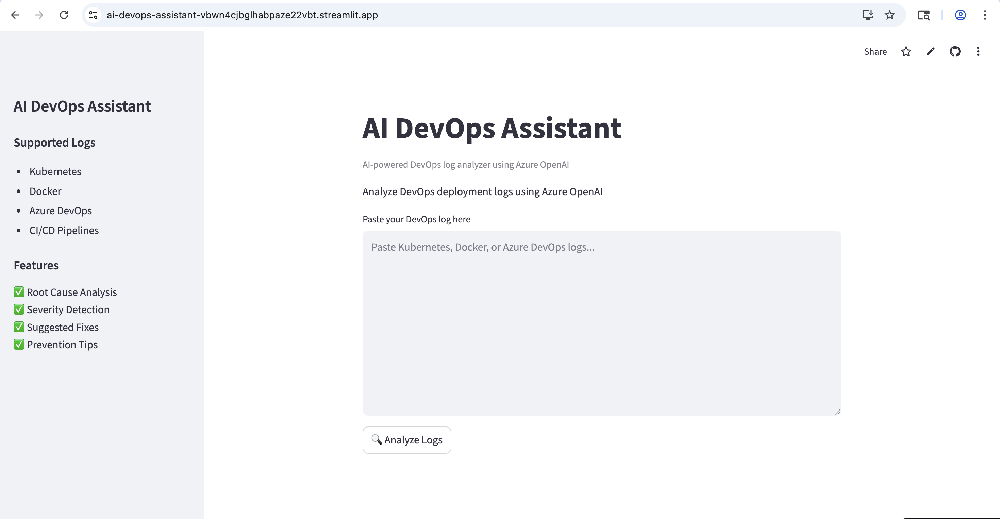

# 🚀 AI DevOps Assistant

AI-powered DevOps Log Analyzer built using Azure OpenAI, LangChain, and Streamlit.

This application helps DevOps engineers analyze deployment logs, identify root causes, determine severity levels, and generate actionable fixes using Generative AI.

---

# 🌍 Live Demo

https://ai-devops-assistant-vbwn4cjbglhabpaze22vbt.streamlit.app/

---

# 📸 Application Screenshot



---

# 🧠 Features

✅ AI-powered DevOps log analysis  
✅ Root cause identification  
✅ Severity detection  
✅ Suggested fixes  
✅ Prevention recommendations  
✅ Azure OpenAI integration  
✅ LangChain integration  
✅ Streamlit UI  
✅ Cloud deployment  

---

# 🏗️ Architecture

```plaintext
User Input
    ↓
Streamlit Frontend
    ↓
LangChain
    ↓
Azure OpenAI
    ↓
AI-generated DevOps Analysis
```

---

# 🛠️ Tech Stack

## Frontend
- Streamlit

## AI Framework
- LangChain

## LLM Provider
- Azure OpenAI

## Programming Language
- Python

## Deployment
- Streamlit Community Cloud

## Version Control
- GitHub

---

# 📂 Project Structure

```plaintext
ai-devops-assistant/
│
├── app.py
├── requirements.txt
├── .gitignore
├── README.md
├── startup.sh
└── venv/
```

---

# ⚙️ Installation

## Clone Repository

```bash
git clone https://github.com/ambhoj10/ai-devops-assistant.git
```

---

## Navigate to Project

```bash
cd ai-devops-assistant
```

---

## Create Virtual Environment

```bash
python3 -m venv venv
source venv/bin/activate
```

---

## Install Dependencies

```bash
pip install -r requirements.txt
```

---

# 🔑 Environment Variables

Create `.env` file:

```env
AZURE_OPENAI_API_KEY=your_key
AZURE_OPENAI_ENDPOINT=your_endpoint
AZURE_OPENAI_DEPLOYMENT=gpt-4o-mini
AZURE_OPENAI_API_VERSION=2024-02-15-preview
```

---

# ▶️ Run Application

```bash
streamlit run app.py
```

---

# 🎯 Sample Use Cases

- Kubernetes deployment failures
- Docker container startup issues
- CI/CD pipeline errors
- Azure DevOps troubleshooting
- Infrastructure log analysis

---

# 🚀 Future Improvements

- PDF log upload
- Multi-log analysis
- RAG integration
- Vector database support
- Deployment monitoring dashboard
- Authentication system

---

# 👨‍💻 Author

Ambhoj Kumar

Aspiring AI Engineer | Azure | DevOps | Generative AI

---

# ⭐ If you found this project useful

Please consider giving it a star on GitHub.
